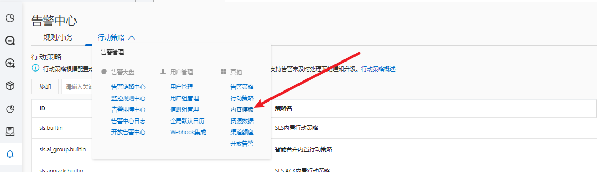

# 3.2.3.Alertmanager对接阿里云开放告警

&#x20;   Alertmanager是开源监控系统Prometheus中用于处理告警信息的服务，通过将日志服务开放告警配置为Alertmanager中的一个Receiver，可以将Alertmanager所产生的报警信息发送到日志服务SLS中。

### 阿里云开放告警配置

使用现有Project，点击进去后选择左侧报警，在右侧页面中开放告警

